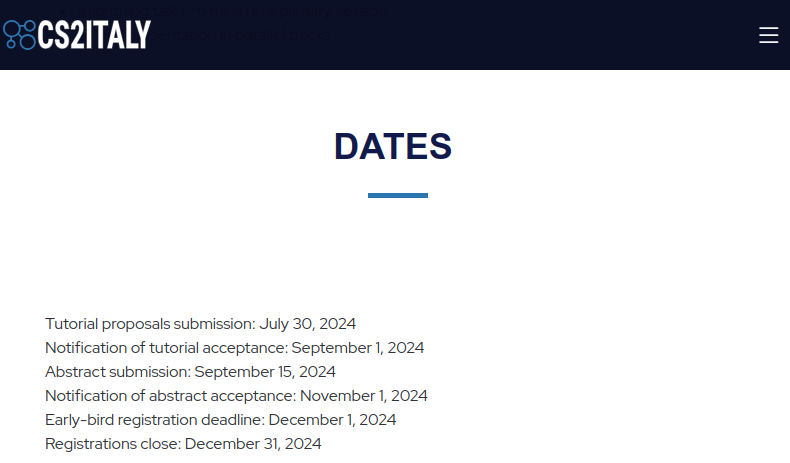
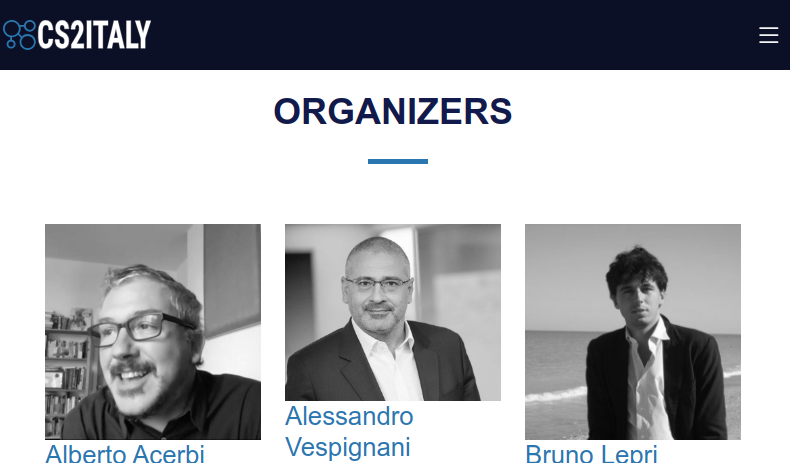

# cs2italy
repository to test the cs2italy website<br/>
Test here<br/>
[https://lihuama.github.io/cs2italy](https://lihuama.github.io/cs2italy)

# organization of the content
the site is created with jekyll technology and published as GitHub page
The directory that contains everything is [docs]()<Br/>
note: the screenshots here can change during the creation of the website

## basic information
in the file [_config.yml](docs/_config.yml) you can define some basic information like 
```yaml
title: CS2Italy 
description: >- # this means to ignore newlines until "baseurl:"
  Join the premier CS2 Italy Conference, a pivotal event for computational social scientists in Italy and internationally. Scheduled for 2025, this conference will feature interdisciplinary collaboration among experts in economics, sociology, psychology, and more. Expect in-depth discussions, innovative research, and the launch of the Society Computational Social Science Italy (CS2 Italy), a new association for scholars in the field
keywords: conference, cs2italy, computational social science, trento, italy, fbk
year: 2025
datelocation: 16-17 January 2025 -Trento, Italy
organizers: University of Trento
```
  
most are visibile on the landing page<br/>

## texts
In the directory [_texts](_texts) there are markdown structured files.
* [01_about.md](docs/_texts/01_about.md) contains the description of the main website<br/>
* [02_topics.md](docs/_texts/02_topics.md) contains the description of the main website<br/>
* [03_dates.md](docs/_texts/03_dates.md) contains the description of the main website<br/>

## tables
The directory [_data](_data) contains tabular files (csv) to store information to show as tables (es. program, speakers ...)<br/>
The order of the list is based on the same order present in the csv file (actualy in alphabetic order from the first column)

* [organizers.csv](_data/organizers.csv) there is the list of the organizers<br/>

## pictures
The images are stored in the directory [img/](docs/assets/img) under the directory [docs/assets](assets).<br/>
- [docs/img/assets/organizers](organizers)<br/>here are present all the photos of the organizers. The prefered size is a square (eg. 800 × 800 like the default photo profile in linkedIN). The website (with the css) transform the photos in black&white.<br/>Very important: each photo must have the same name stored in the csv file of the [organizers](_data/organizers.csv)
