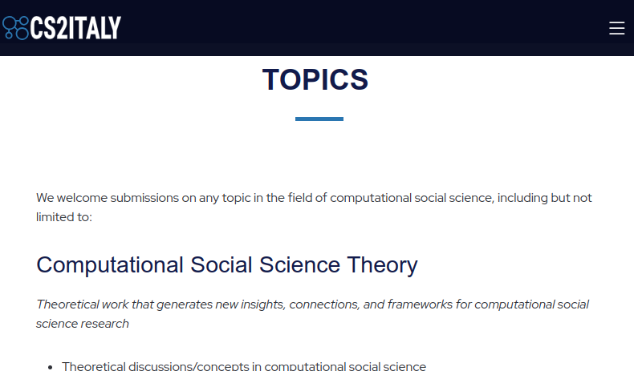

# cs2italy
repository to test the cs2italy website 
Test here 
[https://lihuama.github.io/cs2italy](https://lihuama.github.io/cs2italy)

# organization of the content
the site is created with jekyll technology and published as GitHub page
The directory that contains everything is [docs]() 
note: the screenshots here can change during the creation of the website

## basic information
in the file [_config.yml](docs/_config.yml] you can define some basic information like 
- title: CS2Italy 
- description: >- # this means to ignore newlines until "baseurl:"
  Join the premier CS2 Italy Conference, a pivotal event for computational social scientists in Italy and internationally. Scheduled for 2025, this conference will feature interdisciplinary collaboration among experts in economics, sociology, psychology, and more. Expect in-depth discussions, innovative research, and the launch of the Society Computational Social Science Italy (CS2 Italy), a new association for scholars in the field
- keywords: conference, cs2italy, computational social science, trento, italy, fbk
- year: 2025
- datelocation: 16-17 January 2025 -Trento, Italy
- organizers: University of Trento
  
most are visibile on the landing page
## texts
In the directory [_texts](_texts) there are markdown structured files.
* [01_about.md](docs/_texts/01_about.md) contains the description of the main website 
* [02_topics.md](docs/_texts/02_topics.md) contains the description of the main website 
* [03_dates.md](docs/_texts/03_dates.md) contains the description of the main website 
